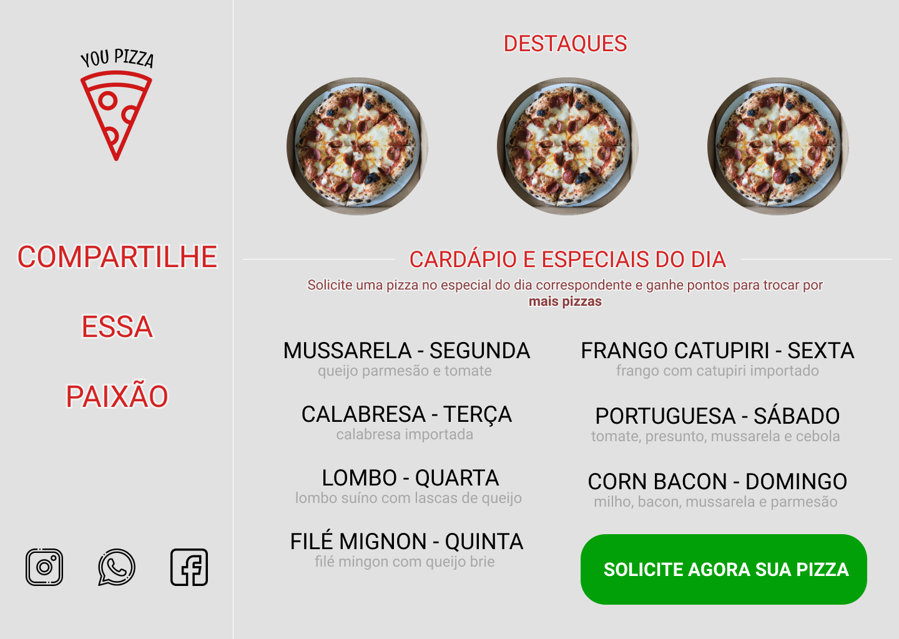

# Front-End-Web

<h1 align="center">
    
</h1>

## Instructions

- This Application have one user previously created but you can register as many as you want. This first User will be created with Sequelize seeds;

- After the Sign In you will enter inside of the Application and you'll see an option to choose what kind of pizza you want, a promotional pizza or about your choice.

**Follow the Options on next**

## Header

- Just for Logout and future upgrades.

## Order a Pizza

- Well it's just follow the sequence of this simple web app.

## Prototype

- https://www.figma.com/file/84AfKrBMxVUfwqCn5nqfNi/YOU-PIZZA

